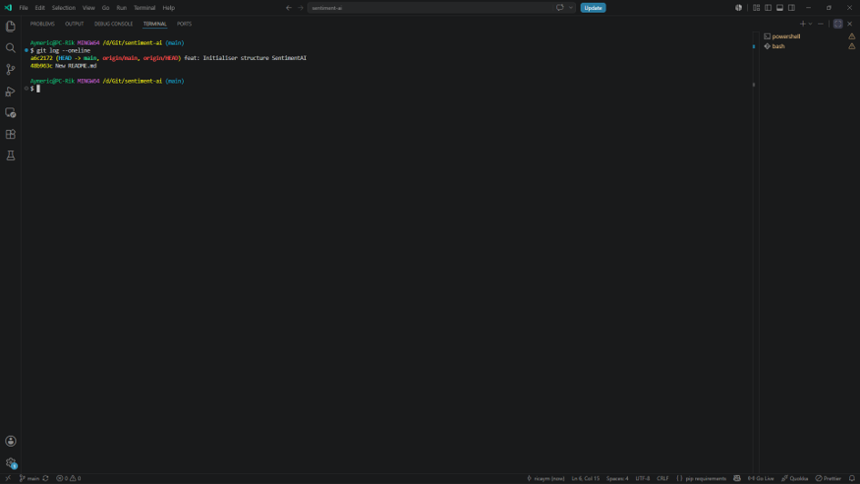
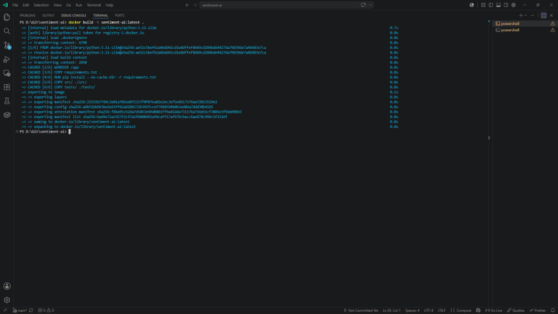
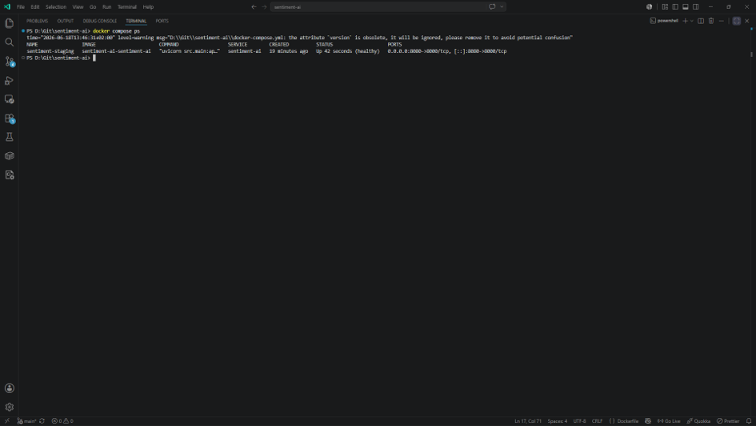
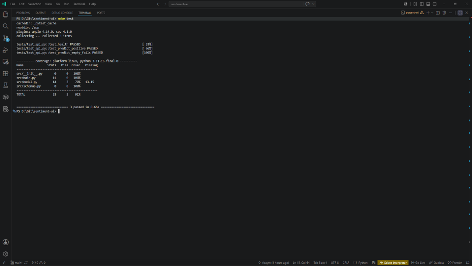
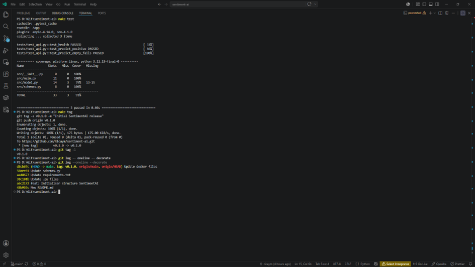
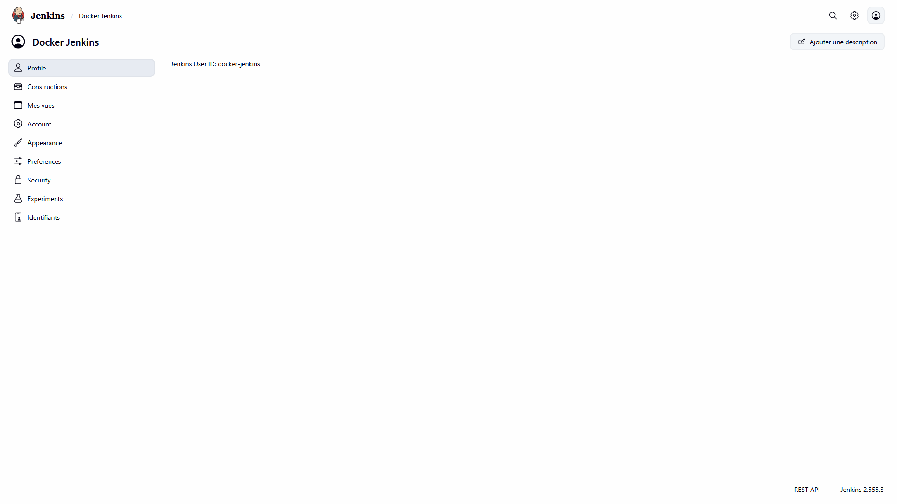
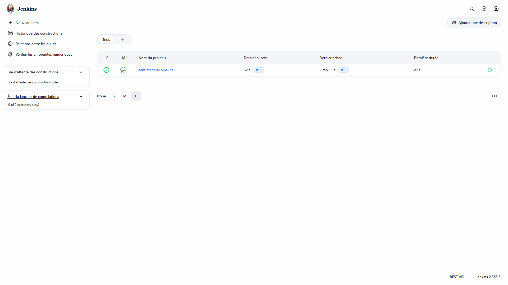
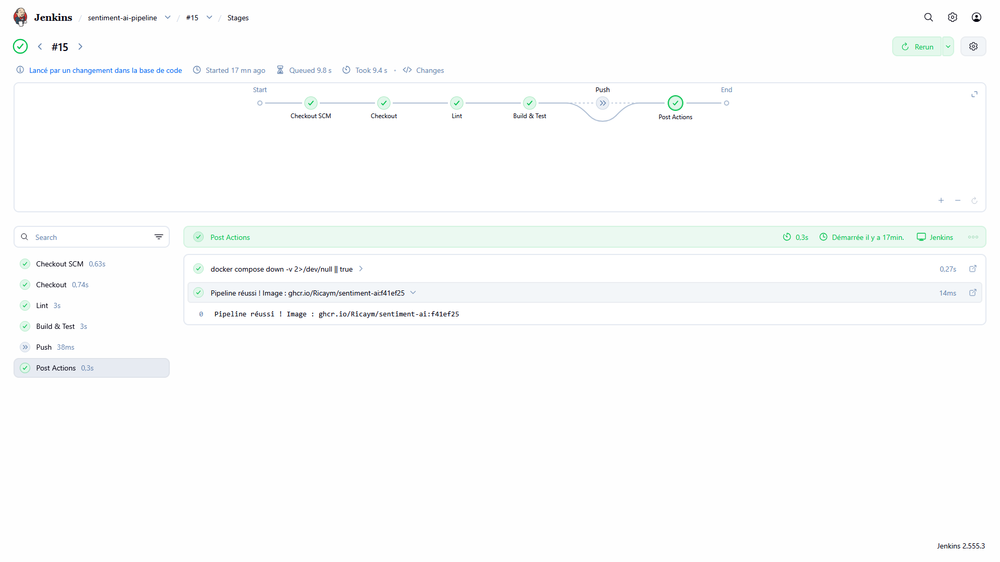
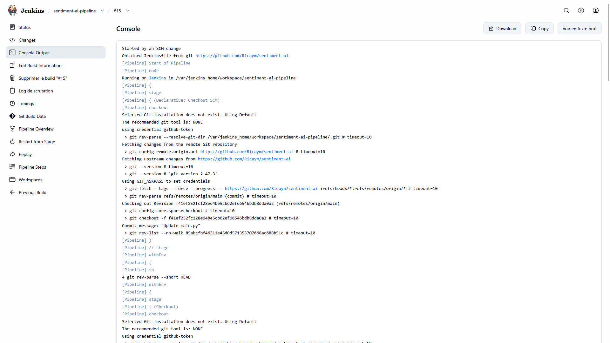

# TP DevOps <!--par Aymeric Chassagne-->
### Par Aymeric Chassagne
[](https://www.python.org/)
[](https://github.com/)
[](https://www.docker.com/)
[](https://www.jenkins.io/)
# 📚 Sommaire
| TP | Sujet | Statut |
|----|--------|---------|
| [TP1 : Git et Docker](#tp1--git-et-docker) | Versioning, Conteneurisation et Docker Compose | ✅ Done |
| [TP2 : Jenkins Pipeline](#tp2--jenkins-pipeline) | Installer Jenkins et créer un pipeline Groovy complet | ⏳ In Progress |
| [TP3 : SonarQube, TrivyQualité & Sécurité](#tp3) | À définir | ⏳ To Do |
| [TP4 : Terraform IaC, Docker provider](#tp4) | À définir | ⏳ To Do |
| [TP5 : Monitoring, Prometheus, Grafana](#tp5) | À définir | ⏳ To Do |
___

# TP1 : Git et Docker

## Contexte
Vous intégrez **StartupIA**, une entreprise qui développe une **plateforme SaaS** d'analyse de sentiments pour les avis clients (e-commerce, réseaux sociaux, CRM). Votre mission est de mettre en place l'infrastructure **DevOps** de **l'API SentimentAI** depuis le dépôt Git jusqu'à **l'image Docker**, en préparation du **pipeline CI/CD automatisé** construit dans les TPs suivants. **SentimentAI** est une **API REST** développée en **FastAPI/Python**. Elle reçoit un **texte en entrée**, l'analyse et **retourne un label** (POSITIF, NÉGATIF ou NEUTRE) accompagné d'un **score de confiance** entre 0 et 1.
___

### 📂 Structure du projet
```text
sentiment-ai/
├── .dockerignore
├── .github/
│   └── workflows/
├── .gitignore
├── Dockerfile
├── Makefile
├── docker-compose.yml
├── requirements.txt
├── src/
│   ├── __init__.py
│   ├── main.py
│   ├── model.py
│   └── schemas.py
└── tests/
    ├── __init__.py
    └── test_api.py
```

### src/schemas.py - Modèles de données Pydantic
```python
from pydantic import BaseModel, Field
from typing import Literal

class PredictionRequest(BaseModel):
	text: str=Field(... , min_length=1 , max_length=5000)

class PredictionResponse(BaseModel):
	label: Literal["POSITIVE", "NEGATIVE", "NEUTRAL"]
	score: float
	text: str
```

### src/model.py - Modèle de sentiment simplifié
```python
class SentimentModel:
	def __init__(self):
		print ("[SentimentModel] Modèle chargé")

	def predict(self, text: str) -> dict:
		text_lower = text.lower()
		positive_words = ["bien", "super", "excellent", "parfait", "bon", "aime", "adore"]
		negative_words = ["mal", "nul", "horrible", "mauvais", "déteste", "pire"]
		pos = sum(1 for w in positive_words if w in text_lower)
		neg = sum(1 for w in negative_words if w in text_lower)
		if pos > neg:
			return {"label": "POSITIVE", "score": round(0.6 + 0.1*pos, 2), "text": text}
		elif neg > pos:
			return {"label": "NEGATIVE", "score": round(0.6 + 0.1*neg, 2), "text": text}
		return {"label": "NEUTRAL", "score": 0.5, "text": text}
```

### src/main.py - Application FastAPI
```python
from fastapi import FastAPI
from src.schemas import PredictionRequest, PredictionResponse
from src.model import SentimentModel

app = FastAPI(title="SentimentAI", version=" 0.1.0 ")

model = SentimentModel()

@app.get ("/health")
def health () :
	"""Endpoint de healthcheck utilisé par Docker et les load balancers."""
	return {"status": "ok"}

@app.post ("/predict", response_model=PredictionResponse)
def predict(request: PredictionRequest):
	"""Analyse le sentiment du texte fourni et retourne un label + score."""
	return model.predict(request.text)

```

### tests/test_api.py - Tests unitaires et d’intégration
```python
from fastapi.testclient import TestClient
from src.main import app

client = TestClient(app)

def test_health():
    """Vérifie que l'endpoint /health répond avec status 200."""
    r = client.get("/health")
    assert r.status_code == 200

def test_predict_positive():
    """Vérifie qu'une pré diction retourne la bonne structure de réponse."""
    r = client.post("/predict", json ={"text": "Ce produit est excellent !"})
    assert r.status_code == 200
    data = r.json()
    assert data["label"] in ["POSITIVE", "NEGATIVE", "NEUTRAL"]
    assert 0 <= data["score"] <= 1

def test_predict_empty_fails():
    """Vérifie que Pydantic rejette un texte vide avec une erreur 422."""
    r = client.post("/predict", json ={"text": ""})
    assert r.status_code == 422
```

### requirements.txt - Dépendances Python
```m
fastapi==0.109.0
uvicorn==0.27.0
pydantic==2.5.3
pytest==7.4.4
pytest-cov==4.1.0
httpx==0.26.0
```
___

**Faites un screenshot de ```git log –oneline``` montrant votre premier commit.**<br>


**Expliquez en deux phrases le rôle du fichier ```.gitignore``` !**<br>
Le fichier .gitignore indique à Git quels fichiers ou dossiers doivent être ignorés et ne pas être suivis dans le dépôt.

**Pourquoi il est important de ne pas committer le dossier ```__pycache__/``` dans Git.**<br>
Il est important de ne pas committer le dossier __pycache__/ car il contient des fichiers Python compilés générés automatiquement, spécifiques à l'environnement d'exécution et inutiles au code source, ce qui encombre inutilement le dépôt.

**Question 1.2 : Quelle est la différence entre ```git add .``` et ```git add -p``` ?**<br>
```git add .``` ajoute toutes les modifications alors que ```git add -p``` permet de choisir précisément quelles modifications ajouter.

**Dans quel cas préférez-vous utiliser ```git add -p``` plutôt que ```git add .``` ?**<br>
Il est préférable d’utiliser ```git add -p``` lorsqu’on a plusieurs gros changements dans un même fichier.

**Faites un screenshot de docker build réussi (dernière ligne) et de la réponse JSON retournée par curl /predict. Identifiez dans la sortie du build les couches qui ont été mises en cache (CACHED) et celles qui ont été recalculées.**<br>


**Relancez docker build une deuxième fois sans rien modifier au projet. Que remarquez-vous dans la sortie ?**<br>
Gnagnagna

**Quelle instruction du Dockerfile ne bénéficie pas du cache si vous modifiez un seul fichier Python dans src/ ? Expliquez pourquoi en vous appuyant sur le principe des layers Docker.**<br>
Gnagnagna

**Question 3.1 :**<br>


**Question 4.1 :**<br>


**Question 4.2 :**<br>


**git tag** est simplement un pointeur vers un commit, il ne contient pas de métadonnées supplémentaires. Pas d’auteur, pas de date, pas de message. Comparable à un signet rapide.
**git tag -a** est un objet git stocké dans la BDD git. Il contient le nom, l’auteur, la date et un message descriptif.

Pourquoi on préfère les tags annotés ? Car ils sont mieux traçables, plus sécurisé / sécurisant (historique plus fiable aussi), et pour la documentation.

## TP2 : Jenkins Pipeline
### Contexte du TP2
SentimentAI est désormais versionnée dans Git et conteneurisée avec Docker (TP1). L’étape suivante consiste à automatiser le cycle build/test/push : à chaque git push, Jenkins récupère le code, le lint, construit l’image Docker, lance les tests et pousse l’image vers le registry si on est sur la branche main. Jenkins est installé lui-même dans un conteneur Docker. Cette approche appelée Docker-out-of-Docker (DooD) - lui permet d’exécuter des commandes docker build en montant le socket Docker de l’hôte.

### 1.1 Lancer Jenkins
1. `docker volume create jenkins-data`<br>
2. `docker run -d --name jenkins -p 8080:8080 -p 50000:50000 -v jenkins-data:/var/jenkins_home -v /var/run/docker.sock:/var/run/docker.sock jenkins/jenkins:lts`<br>
3. `docker logs -f jenkins`<br>
4. `docker exec -u jenkins jenkins docker ps`
5. `docker exec -u root jenkins bash -c "apt-get update -q && apt-get install -y docker.io"`

### 1.2 Première configuration Jenkins
1. Ouvrez http://localhost:8080 dans votre navigateur.
2. Récupérez le mot de passe initial : `docker exec jenkins cat/var/jenkins_home/secrets/initialAdminPassword`
3. Choisissez "Install suggested plugins" et attendre la fin de l’installation.
4. Créez votre compte administrateur (notez login/mot de passe).
5. Cliquez "Save and Finish" → "Start using Jenkins".

```Dockerfile
Fichier Jenkinsfile

pipeline {
    agent any

    environment {
        IMAGE_NAME = 'sentiment-ai'
        REGISTRY = 'ghcr.io/Ricaym'
        IMAGE_TAG = sh(script : 'git rev-parse --short HEAD', returnStdout:true).trim()
    }
    stages {
        stage ('Checkout') {
            steps {
                checkout scm
                echo "Branche : ${env.BRANCH_NAME}"
                echo "Commit : ${env.GIT_COMMIT} "
                sh 'git log --oneline -5'
            }
        }
        stage ('Lint') {
            steps {
                sh '''
                    docker run --rm --volumes-from jenkins -w $WORKSPACE python:3.12-slim sh -c "pip install flake8 -q && flake8 src/ --max-line-length=100"
                '''
            }
        }
        stage ('Build & Test') {
            steps {
                sh "docker build -t ${IMAGE_NAME}:${IMAGE_TAG} ."
                sh '''
                    docker run --rm ${IMAGE_NAME}:${IMAGE_TAG} pytest tests/ -v --cov=src --cov-report=xml:coverage.xml --cov-report=term-missing --cov-fail-under=70
                '''
            }
            post {
                failure {
                    echo 'Tests échoués ou coverage insuffisant (<70%)'
                }
            }
        }
        stage ('Push') {
            when {branch 'main'}
            steps {
                withCredentials ([usernamePassword(credentialsId : 'github-token', usernameVariable : 'REGISTRY_USER', passwordVariable : 'REGISTRY_PASS')]) {
                    sh '''
                        echo \$REGISTRY_PASS | docker login ghcr.io -u \$REGISTRY_USER --password-stdin docker push ${REGISTRY}/${IMAGE_NAME}:${IMAGE_TAG} docker tag ${IMAGE_NAME}:${IMAGE_TAG} ${REGISTRY}/${IMAGE_NAME}:latest docker push ${REGISTRY}/${IMAGE_NAME}:latest
                    '''
                }
            }
        }
    }
    post {
        always {
            sh 'docker compose down -v 2>/dev/null || true'
        }
        success {
            echo " Pipeline réussi ! Image : ${REGISTRY}/${IMAGE_NAME}:${IMAGE_TAG}"
        }
        failure {
            echo 'Pipeline échoué. Consultez les logs ci-dessus.'
        }
    }
}
```

**Question 1.1 : Faites un screenshot de la page d’accueil Jenkins (Dashboard) avec votre compte connecté**<br>


**Question 1.1 : Quel est le rôle du volume jenkins-data monté sur /var/jenkins_home ?**<br>
Le rôle du volume jenkins-data monté sur /var/jenkins_home est de persister toutes les données Jenkins en dehors du conteneur afin qu'elles survivent aux redémarrages, mises à jour ou recréations du conteneur.

**Question 1.2 : Expliquez en deux phrases pourquoi on monte /var/run/docker.sock dans le conteneur Jenkins. Quel risque de sécurité cela représente-t-il ? Comment le limiterait-on en production ?**<br>
On monte /var/run/docker.sock dans le conteneur Jenkins pour permettre aux jobs Jenkins de communiquer avec le démon Docker de l'hôte et ainsi construire, lancer, arrêter ou supprimer des conteneurs Docker. Cela évite d'exécuter un démon Docker complet à l'intérieur du conteneur Jenkins (approche Docker-outside-of-Docker).
Le risque majeur est qu'un utilisateur ou un pipeline compromis dans Jenkins obtienne pratiquement les mêmes privilèges que l'utilisateur Docker sur l'hôte, pouvant aller jusqu'à une prise de contrôle complète du serveur. En production, on limite ce risque en évitant autant que possible l'accès direct au socket Docker, en utilisant des agents Jenkins dédiés et isolés, des runners éphémères, des mécanismes d'autorisation stricts, ou en remplaçant l'accès au socket par des solutions plus cloisonnées (Kubernetes, BuildKit distant, Kaniko, Podman, etc.).

**Question 2.1 : À quoi sert le bloc post{always{}} dans le pipeline ? Pourquoi ajoute-t-on || true à la commande docker compose down ?**<br>
Le bloc suivant sert à exécuter certaines actions quelle que soit l'issue du pipeline : succès, échec, interruption ou abandon. On l'utilise généralement pour le nettoyage des ressources, la suppression des conteneurs temporaires, l'archivage de logs ou l'envoi de notifications.

**Question 2.2 : Expliquez la différence entre ```agent any``` et ```agent {docker{image 'python:3.11'}}```. Dans quel cas utiliseriez-vous le second ?**<br>
```agent any``` exécute le pipeline directement sur un agent Jenkins disponible en utilisant les outils installés sur cet agent. ```agent {docker{image 'python:3.11'}}``` exécute le pipeline dans un conteneur Docker Python 3.11, ce qui garantit un environnement isolé et reproductible, on l'utilise lorsqu'un projet nécessite des versions ou des dépendances spécifiques.

**Question 2.2 : Pourquoi le stage Push utilise-t-il ```when {branch 'main'}``` ? Que se passerait-il si on poussait une image pour chaque branche feature ?**<br>
```when { branch 'main' }``` limite le push d’image Docker à la branche stable main, pour éviter de publier des images non validées depuis des branches de développement. Si chaque branche feature poussait une image, le registre serait vite pollué par des images temporaires, potentiellement instables, coûteuses à stocker et difficiles à tracer, pire, une mauvaise stratégie de tag pourrait écraser une image légitime.

**Question 2.3 : Pourquoi le stage Push utilise-t-il when { branch ’main’ } ? Que se passerait-il si on poussait une image pour chaque branche feature ?**<br>
Le stage Push utilise when { branch 'main' } pour ne publier que les images issues de la branche principale, considérée comme la version de référence validée. Si chaque branche feature poussait une image, le registre Docker serait encombré d'images temporaires et potentiellement instables, augmentant les coûts de stockage et le risque d'utiliser ou d'écraser une mauvaise version.

**Question 3.1 : Faites un screenshot du pipeline après le premier build réussi (vue stages ou Console Output). Quel tag a été attribué à l’image Docker construite ? Retrouvez cette valeur dans les logs Jenkins.**<br>


Le tag suivant a été attribué à l'image docker construite : ```sentiment-ai:6d8294b```

**Question 3.2 : Faites un second build en modifiant un fichier source (par exemple, ajouter un commentaire dans src/main.py). Le pipeline se relance-t-il automatiquement au bout de 5 minutes ? Vérifiez sur GitHub : l’image apparaît-elle dans les Packages / Registry ?**<br>
Oui il se relance bien automatiquement après 5 minutes
On peut voir le texte ```Started by an SCM change``` au début du build.


**Question 4.1 : Le pipeline s’est-il déclenché automatiquement après le push ? Faites un screenshot du build automatique. Quelle est la différence entre Poll SCM et un webhook en termes de délai et de charge serveur ?**<br>
Oui le pipeline s'est déclenché automatiquement après le push


**A. Architecture Jenkins**

1. Les 4 stages typiques du pipeline SentimentAI:
Checkout : récupère le code source depuis le dépôt Git afin que Jenkins travaille sur la bonne version du projet.
Test / Quality : exécute les tests et contrôles qualité pour détecter rapidement les erreurs de code avant de construire l’application.
Build Docker : construit l’image Docker de l’application SentimentAI à partir du Dockerfile.
Push : publie l’image Docker dans le registre afin qu’elle puisse être déployée ensuite.

1. Un agent Jenkins est l’environnement d’exécution dans lequel un job ou un stage Jenkins tourne : machine, conteneur, nœud distant, etc.
agent any signifie que Jenkins peut exécuter le pipeline sur n’importe quel agent disponible.
Un agent Docker dédié lance le stage dans un conteneur précis, avec une image choisie, par exemple Python, Maven, Node ou Docker CLI. C’est plus reproductible, car l’environnement est contrôlé au lieu de dépendre de la machine Jenkins.

1. On utilise withCredentials parce qu’un token est un secret. L’écrire directement dans le Jenkinsfile est une mauvaise pratique : il serait visible dans Git, dans l’historique, potentiellement dans les logs, et récupérable par toute personne ayant accès au dépôt. withCredentials injecte le secret temporairement et limite son exposition 🔐.

**B. CI/CD et Qualité**

1. Le fail fast consiste à faire échouer le pipeline le plus tôt possible dès qu’un problème est détecté. Le but est d’éviter de perdre du temps à builder, tagger ou pousser une image Docker si le code est déjà invalide. Si le code est mal écrit, le stage qui doit échouer en premier est le stage Test / Quality, avant le build Docker.

2. On ne pousse pas une image pour chaque branche feature parce que cela pollue le registre avec des images temporaires, augmente le stockage utilisé, complique la traçabilité et peut créer de la confusion sur ce qui est réellement déployable. La branche main représente normalement un état validé, stable ou proche de la production. Les branches feature doivent surtout être testées, pas forcément publiées comme artefacts officiels.

3. Workflow complet en 5 étapes maximum :
Un développeur fait un git push vers le dépôt.
Jenkins détecte le changement via webhook ou polling.
Jenkins récupère le code et lance les tests/contrôles qualité.
Si tout passe, Jenkins construit l’image Docker.
Sur main, Jenkins tague puis pousse l’image dans le Docker Registry.

**C. Traçabilité et Versionnement**

1. Pour retrouver le code exact, on va dans le dépôt Git et on cherche le commit : ```git checkout a3f8c12``` ou ```git show a3f8c12```

2. On pousse deux tags, :SHA et :latest, parce qu’ils n’ont pas le même rôle.
   - Le tag :SHA, par exemple sentiment-ai:a3f8c12, est un tag immuable de traçabilité. Il sert à savoir exactement quelle version du code a produit l’image. C’est celui qu’il faut privilégier pour les déploiements sérieux.
   - Le tag :latest est un alias pratique vers la dernière image construite. Il est utile pour les tests rapides ou les environnements non critiques, mais il est dangereux pour la production car il change avec le temps et ne garantit pas une version précise.


## TP3

Contenu du TP3...

## TP4 : Terraform IaC, Docker provider

Contenu du TP4...

## TP5

Contenu du TP5...
